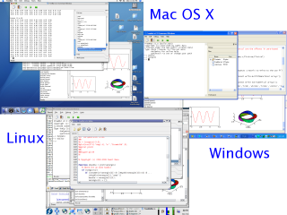

Home
====

FreeMat is a free environment for rapid engineering and scientific prototyping and data processing. It is similar to commercial systems such as MATLAB from Mathworks, and IDL from Research Systems, but is Open Source. FreeMat is available under the GPL license.

 

Latest News - 2008-03-17 - FreeMat 3.6 Released
-----------------------------------------------
We are pleased to announce the release of FreeMat 3.6. This is primarily a bugfix release that adds a few new features,
mostly to the UI. Here is the list of changes:

 * Added ODE45 solver from Sebastien Loisel
 * Added SVG support for exporting figures.
 * Added "recent files" to editor.
 * Added keyboard shortcuts to editor and main application menus.
 * Added increase/decrease indent by tab/shift-tab in editor
 * Added execute button to debug toolbar
 * Added quiver plots
 * Added execute-selected-text button
 * Added directory-change tool to main toolbar, and rearranged windows on the main page.
 * Second pass at the JIT compiler.  Completion of the JIT and it's general activation will wait for FreeMat4.
 * Display of complex numbers
 * Helpwin now accepts an argument.
 * Replaced the toolbox with a tabbed widget.
 * Code clean up for -Wall.
 * Improved the behavior of editor when opening and saving (new)files.
 * Corrected norms of double args on 64 bit machines
 * Interplin1 now works with more argument types.
 * Any, all, min and max handle empties more gracefully.
 * Corrected color display of RGB images
 * Modified bitcmp function for compatibility with matlab
 * Modified fprintf to follow matlab's behavior when no handle is specified.
 * Set default view for 3D plots to view(3).
 * Fixes for anonymous functions and code block leaks.
 * Fixed the "comment" and "uncomment" bugs when applying to the whole
 * Fixed failed feval for local functions
 * Fixed program crash after clear history.
 * Fixed bug in complex matrix assignment operators.
